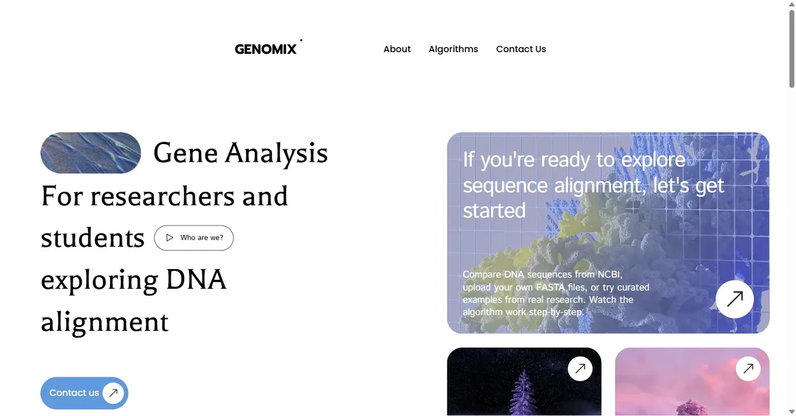
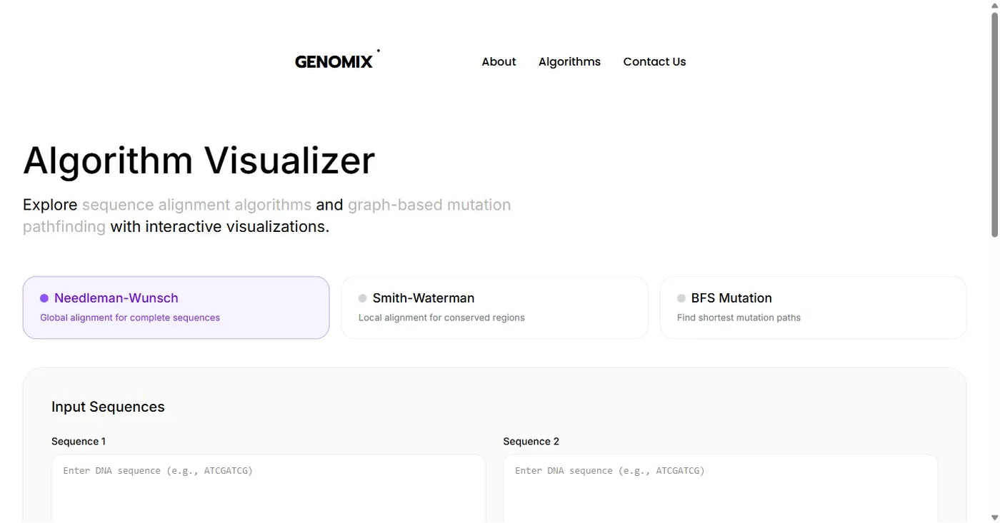

# GENOMIX

**Interactive DNA sequence alignment and mutation pathfinding, visualized step by step.**

GENOMIX is a web app for researchers and students exploring DNA alignment. It implements three classic bioinformatics algorithms from scratch and animates exactly how each one works, the dynamic-programming matrix filling in cell by cell, the traceback retracing the optimal path, and a breadth-first search expanding through a gene-mutation graph.

🔗 **Live:** https://bioinfo-project.vercel.app



---

## What it does

GENOMIX turns three textbook algorithms into something you can watch and poke at:

| Algorithm | Problem it solves | Type |
|---|---|---|
| **Needleman-Wunsch** | Best end-to-end alignment of two full sequences | Global alignment (dynamic programming) |
| **Smith-Waterman** | Best matching sub-region between two sequences | Local alignment (dynamic programming) |
| **BFS Minimum Genetic Mutation** | Fewest single-character mutations to get from one gene to another through a valid bank | Shortest path (graph BFS) |

For each run you get the result *and* the reasoning: the full scoring matrix, the traceback path, per-position match / mismatch / gap marks, percent identity, and a play/pause/step animation of how the answer was reached.



## Features

- **Three algorithms, implemented from scratch** in TypeScript, no bio libraries.
- **Step-by-step animation** with playback controls (play, pause, step, speed). Alignment runs animate matrix initialization → fill → traceback; BFS animates the queue, visited set, and discovered path.
- **Full scoring matrix + traceback visualization**, plus a graph view for the mutation algorithm.
- **Configurable scoring scheme** (match / mismatch / gap penalties).
- **Alignment statistics**: score, matches, mismatches, gaps, and percent identity. Sequence stats include length, base composition, and GC content.
- **Curated examples** across educational, evolutionary, and medical categories so you can explore meaningful cases without typing sequences.
- **Input validation** for DNA (`A C G T`), optional amino-acid codes, and the BFS gene rules (exactly 8 characters, `ACGT`, end gene must exist in the bank).
- **Non-blocking compute**: heavy runs are offloaded to a Web Worker so the UI stays responsive.
- **Responsive, animated UI** with a glassmorphism component set and Framer Motion transitions.

## Algorithms in brief

- **Needleman-Wunsch** builds an `(m+1) × (n+1)` matrix, fills each cell with `max(diagonal, up, left)` using the scoring scheme, then tracebacks from the bottom-right corner to recover the optimal global alignment. Time and space are `O(m·n)`.
- **Smith-Waterman** uses the same DP shape but clamps negative scores to `0` and tracebacks from the highest-scoring cell, yielding the best *local* (sub-sequence) alignment with start/end positions. `O(m·n)`.
- **BFS Minimum Genetic Mutation** models genes as graph nodes where an edge connects two genes that differ by exactly one nucleotide. A breadth-first search from the start gene finds the shortest valid mutation path through the bank, recording the queue and visited set at each step for visualization.

## Tech stack

- **Next.js 16** (App Router, Turbopack) + **React 19**
- **TypeScript**
- **Tailwind CSS v4**
- **Framer Motion** for animation
- **Zustand** for the animation/playback state store
- **Web Workers** for off-main-thread computation
- Deployed on **Vercel**

## Project structure

```
src/
  app/
    page.tsx              # Landing page
    algorithms/           # Main algorithm visualizer
    needleman/            # Dedicated Needleman-Wunsch view
    smith-waterman/       # Dedicated Smith-Waterman view
    layout.tsx            # Root layout, fonts, metadata
  lib/
    algorithms/           # needleman-wunsch.ts, smith-waterman.ts, bfs-mutation.ts
    workers/              # Web Worker that runs algorithms off the main thread
    stores/              # Zustand animation store (steps, playback)
    utils/               # Sequence validation, cleaning, stats
    motion/              # Framer Motion variants
    hooks/               # e.g. useTypewriter
  components/            # UI: matrix + graph visualizations, inputs, glass components
  data/                 # Curated alignment + mutation examples
  types/                # Shared types and constants
```

## Getting started

```bash
# install
npm install

# run the dev server
npm run dev
# open http://localhost:3000

# production build
npm run build
npm run start

# lint
npm run lint
```

## How it works

The algorithm code is pure, framework-free TypeScript. Each algorithm exposes two functions: one that returns the result (`needlemanWunsch`, `smithWaterman`, `minGeneticMutation`) and one that returns an ordered list of **animation steps** describing every matrix cell or BFS action. The Zustand store plays those steps back at a controllable speed, and the visualization components render the current step. Because computing a large matrix plus all its steps can be expensive, that work runs inside a Web Worker, keeping the interface smooth.

## Limits and constraints

- Alignment sequences up to **5,000** characters; step-by-step animation is generated only for short sequences (≤ 15 each) to keep playback meaningful.
- BFS genes must be exactly **8** characters of `ACGT`, and the end gene must be present in the bank.
- Sequences are entered or pasted directly (or loaded from the curated examples). The "NCBI" branding on the landing page reflects the data sources these algorithms are used with; live database fetching is not part of this build.

## Deployment

Any Next.js host works. It is deployed on Vercel; pushing to the default branch (or running `vercel --prod`) ships a new build.
